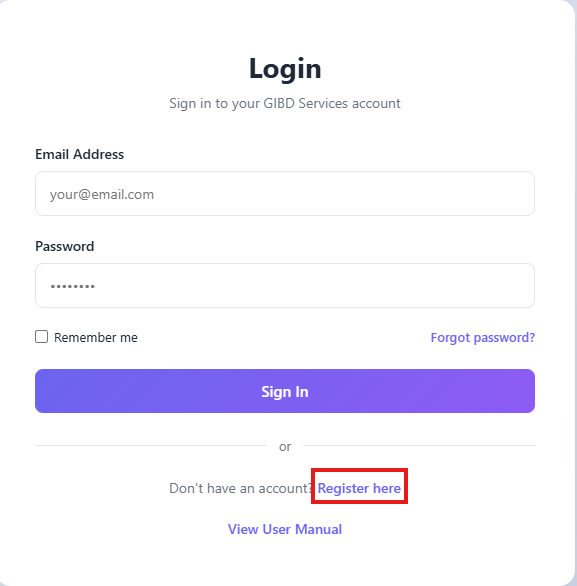
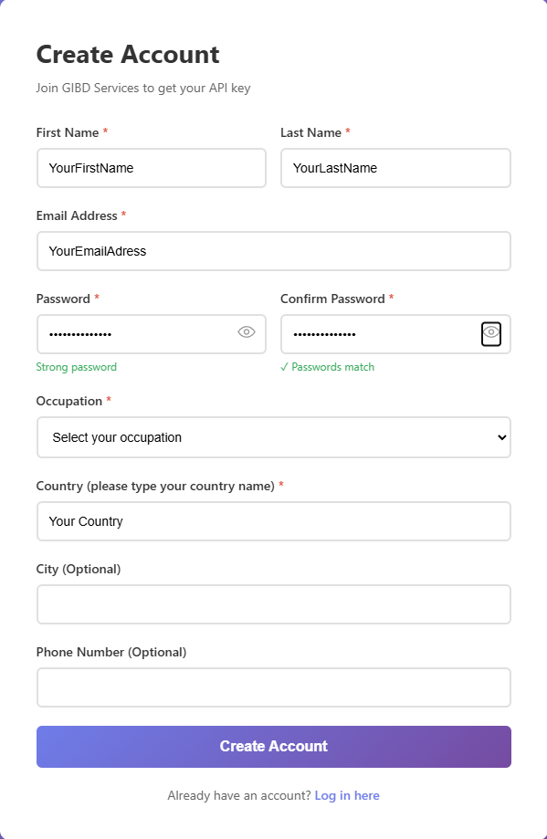

# Obtaining an API Key from GIBD-Services

To use **GIBD-Services**, you will first need to obtain an GIBD API key [here](https://www.gibd.online/). This key authenticates your access to the service and enables secure interaction with the tools and resources provided. 

**Note: Registered users could make up to 100 requests (spatial problems) each day through December 31, 2025 using the GIDB API Key.**

## Creating an Account
- Go to the GIBD UMS (user management system) website (https://www.gibd.online/).
- Navigate to the Create Account page by selecting  Register here, and
- Fill in the required fields (*) and click the Create Account button to submit.

**Note: Registered users have 100 questions (spatial problems) to request each day through December 31, 2025.**

## Account Verification and Login
- After completing the registration, check your email for a verification link and confirm your account (also check your Spam folder if you don't receive the verification email within several minutes).
- Once verified, log in using the email and password you created to proceed to your dashboard.
- On your dashboard, click on **Generate New API Key** and copy the generated key.

## Data and Privacy Information

When using a **GIBD API key**, certain information is logged to help us further improve performance of the GIS Copilot. The following details may be logged:

- User query and AI-generated task breakdown for the specific query  
- Selected tools and geoprocessing workflow  
- Final code generated  
- Any errors encountered during code execution
- Limited information about the data including data type, CRS, and column names.

**Important:** GIBD-Services does **not** collect or access your actual data. These collection policies apply **only** when using a GIBD API key. They do **not** apply when using an OpenAI API key. When uisng an OpenAI API key, no information is collected. 
